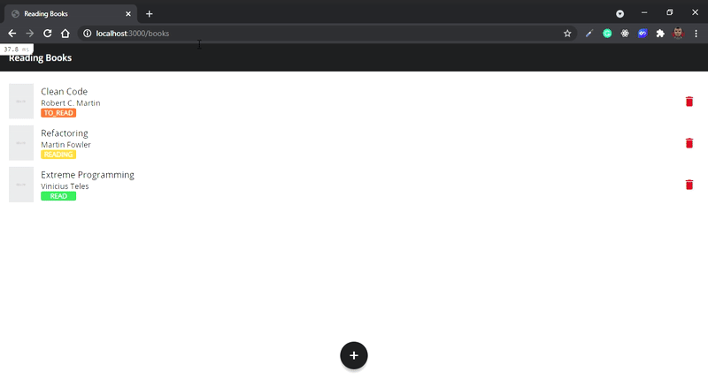

<h1 align="center">
  Reading Books
</h1>

<p align="center">
  <a href="#rocket-project">Project</a>&nbsp;&nbsp;&nbsp;|&nbsp;&nbsp;&nbsp;
  <a href="#computer-techs">Techs</a>&nbsp;&nbsp;&nbsp;|&nbsp;&nbsp;&nbsp;
  <a href="#thinking-how-to-use">How to use</a>&nbsp;&nbsp;&nbsp;|&nbsp;&nbsp;&nbsp;
  <a href="#memo-license">License</a>
</p>

## :rocket: Project

:books: Reading Books manages the books you are reading

### Preview

<p align="center">

</p>

### User Stories

[x] As a user I can create a book

[x] As a user I can see the details of a book

[x] As a user I can update a book

[x] As a user I can delete a book

[x] As a user I can see all my books

[x] As a user I can put a book on my "To read" list

[x] As a user I can put a book on my "Reading" list

[x] As a user I can put a book on my "Read" list

## :computer: Techs

- Ruby
- Ruby on Rails
- SQLite3

## :thinking: How to use

```sh
git clone https://github.com/flaviogf/reading_books.git

cd reading_books

bundle install

rails webpacker:yarn_install

bin/rails db:migrate

bin/rails db:seed

bin/rails server

# It's running at http://localhost:3000
```

## :memo: License

This project contains the MIT license. See the file [LICENSE](LICENSE).
